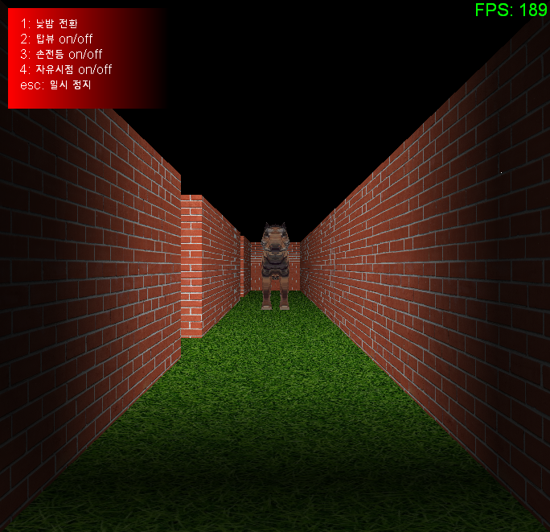

# 3D DirectX9 Maze

DirectX9 기반 1인칭 미로 탐색 게임입니다. 취업 준비 기간에 그래픽스 파이프라인, 카메라, 입력 처리, 충돌 처리, 간단한 게임 오브젝트를 직접 구현해 보기 위해 만든 프로젝트입니다.

- 시연 영상: https://youtu.be/5bMy5FtiVVI
- 솔루션: `DirectX9_Maze.sln`
- 주요 프로젝트: `D3D_MyFPS.vcxproj`



## 주요 기능

- Direct3D9 기반 렌더링 루프
- 1인칭 카메라와 마우스 시점 회전
- WASD/방향키 기반 플레이어 이동
- 타일 맵 기반 미로와 벽 충돌 처리
- 외부 목록 기반 다중 레벨 로딩과 클리어 후 전환
- 안내문, 출구, 클리어 UI
- 스카이박스와 낮/밤 전환
- 플레이어 손전등용 스팟 라이트
- 탑뷰/자유시점 디버그 뷰
- 프러스텀 컬링
- X 파일 기반 호랑이 모델 로딩과 간단한 미로 이동 AI
- 총알 발사와 시간 기반 이동 처리

## 조작법

| 입력 | 동작 |
| --- | --- |
| `W`/`A`/`S`/`D`, 방향키 | 이동 |
| 마우스 이동 | 시점 회전 |
| 마우스 왼쪽 클릭 | 총알 발사 |
| `Q`/`E` | 좌우 회전 |
| `1` | 낮/밤 전환 |
| `F2` (Debug 빌드) | 컬링 확인용 탑뷰 전환 |
| `3` | 손전등 전환 |
| `4` | 자유시점 전환 |
| `Esc` | 일시정지 |

## 코드 구성

| 파일 | 역할 |
| --- | --- |
| `main.cpp`, `main.h` | Direct3D 초기화, 메인 루프, 렌더링, 전역 게임 상태 |
| `Player.*` | 플레이어 이동, 회전, 충돌, 총알, 손전등 |
| `MazeGenerator.*` | 맵 데이터 기반 벽 버텍스 생성 |
| `MazeLoader.*`, `MazeDefinition.h` | 외부 레벨 파일 검증과 런타임 미로 데이터 |
| `LevelCatalog.*` | 외부 레벨 목록의 순서와 경로 검증 |
| `Frustum.*` | 프러스텀 평면 계산과 컬링 판정 |
| `SkyBox.*` | 스카이박스 텍스처와 렌더링 |
| `Notice.*`, `Exit.*` | 안내문과 출구 오브젝트 |
| `Tiger.*` | X 파일 모델 로딩, 재질·텍스처 처리와 호랑이 이동 |
| `Assets/Models`, `Assets/Textures` | 런타임 모델과 용도별 텍스처 |
| `Input.*` | 키 입력 상태 관리 |
| `FpsCounter.*` | 메인 루프의 delta time을 이용한 FPS 계산 |
| `ComUtils.h` | COM 포인터의 null 안전한 공통 해제 |
| `D3D_MyFPS.Tests` | Direct3D 실행 없이 순수 로직을 검증하는 콘솔 테스트 |
| `Assets/Data/Levels` | 문자 기반 미로 레벨과 작성 규칙 |

## 개발 환경

- Visual Studio 2022와 `Desktop development with C++` 워크로드
- Windows 10 SDK
- Platform Toolset `v143`
- DirectX SDK June 2010

현재 기준 구성은 솔루션의 `Debug|x86`입니다. 이 구성은 프로젝트에서 `Debug|Win32`로 매핑되며 다음 DirectX SDK 기본 설치 경로를 참조합니다.

```text
C:\Program Files (x86)\Microsoft DirectX SDK (June 2010)\Include
C:\Program Files (x86)\Microsoft DirectX SDK (June 2010)\Lib\x86
```

## 빌드 및 실행

### Visual Studio

1. 위 개발 환경과 DirectX SDK를 설치합니다.
2. 저장소 루트의 `DirectX9_Maze.sln`을 Visual Studio 2022로 엽니다.
3. 솔루션 구성을 `Debug`, 플랫폼을 `x86`으로 선택합니다.
4. `D3D_MyFPS` 프로젝트를 시작 프로젝트로 설정합니다.
5. `Build > Build Solution`으로 빌드합니다.
6. `Debug > Start Without Debugging`으로 실행합니다.

빌드 결과는 저장소 루트의 `Debug/DirectX9_Maze.exe`에 생성됩니다. 텍스처와 X 파일 모델을 상대 경로로 읽으므로 실행 작업 디렉터리는 저장소 루트여야 합니다. Visual Studio에서 실행하면 기본 프로젝트 디렉터리가 사용됩니다.

### 명령줄

Visual Studio 2022 Community 기본 설치 경로를 사용하는 경우, 저장소 루트의 PowerShell에서 다음 명령으로 빌드할 수 있습니다.

```powershell
& "C:\Program Files\Microsoft Visual Studio\2022\Community\MSBuild\Current\Bin\MSBuild.exe" `
  .\DirectX9_Maze.sln /p:Configuration=Debug /p:Platform=x86
```

빌드 후 같은 저장소 루트에서 실행합니다.

```powershell
.\Debug\DirectX9_Maze.exe
```

미로 로더 자동 테스트는 같은 위치에서 다음 명령으로 실행합니다.

```powershell
.\Debug\D3D_MyFPS.Tests.exe
```

모든 테스트가 통과하면 종료 코드 `0`, 하나라도 실패하면 종료 코드 `1`을 반환합니다.

### 구성 제약

- 현재 빌드와 실행이 확인된 구성은 `Debug|x86`입니다.
- `x64`와 `Release` 구성은 DirectX SDK include, library와 linker 설정이 동일하게 구성되어 있지 않아 검증 대상에서 제외합니다.
- `d3dx9.h` 또는 `d3dx9.lib`를 찾지 못하면 DirectX SDK 설치 여부와 위 기본 경로를 확인합니다.
- 텍스처나 호랑이 모델이 표시되지 않으면 실행 작업 디렉터리가 저장소 루트인지 확인합니다.

## 현재 검증 상태

- `Debug|x86` 빌드 성공: 경고 0개, 오류 0개
- Windows 환경에서 게임 실행 정상 확인
- UTF-8 소스 변환 후 한글 문자열 출력 정상 확인
- 필수 텍스처 누락 시 초기화 실패 안내 후 크래시 없이 종료됨을 확인
- 미로 로더, 레벨 목록과 셀 좌표 변환 자동 테스트 11개 통과
- 서로 다른 크기의 `Level01`과 `Level02` 전환 및 상태·리소스 재설정 확인
- 수동 검증 절차: [`docs/SMOKE_TEST.md`](docs/SMOKE_TEST.md)
- 외부 에셋 출처와 공개 상태: [`docs/ASSET_LICENSES.md`](docs/ASSET_LICENSES.md)

## 구현하며 다룬 문제

- 프레임 속도에 따라 이동 속도가 달라지는 문제를 시간 기반 이동으로 완화했습니다.
- 마우스 커서를 윈도우 중앙으로 되돌리며 FPS 스타일 시점 회전을 구현했습니다.
- 외부 문자 기반 레벨 파일을 검증해 가변 크기 미로와 플레이어·적 시작점, 안내판, 출구를 구성하도록 개선했습니다.
- 외부 레벨 목록을 순서대로 읽고 클리어 시 기존 지오메트리와 게임 상태를 정리한 뒤 다음 미로를 재구성합니다.
- Billboard 회전을 기본 방향에서 다시 계산해 누적 오차를 제거하고 레벨 전환·자유시점 복원 시 즉시 방향을 갱신합니다.
- 카메라 프러스텀을 계산해 타일과 벽 면을 그릴지 판단했습니다.
- X 파일 모델을 로드하고, 미로의 통로 정보를 사용해 호랑이가 이동하도록 만들었습니다.

## 현재 한계

이 프로젝트는 학습용으로 시작해 기능을 빠르게 붙인 코드라 구조적인 부채가 남아 있습니다.

- `main.cpp`에 초기화, 입력, 업데이트, 렌더링, UI, 게임 규칙이 많이 모여 있습니다.
- 전역 상태와 리소스 소유 객체가 여러 모듈에 걸쳐 있어 전체 수명 주기를 파악하기 어렵습니다.
- UI 좌표와 일부 게임 설정 값이 `main.cpp`에 하드코딩되어 있습니다.
- 자동 테스트는 미로 로더, 레벨 목록과 좌표 변환에 한정되며 Direct3D 리소스 전환과 플레이 동작은 수동 검증에 의존합니다.
- 현재는 `Debug|x86`만 검증되었으며 `x64`와 `Release` 구성은 별도 정리가 필요합니다.

장기 개선 방향과 진행 상태는 [`PROJECT_GUIDE.md`](PROJECT_GUIDE.md)와 [`docs/ROADMAP.md`](docs/ROADMAP.md)를 참고하세요. 프로젝트별 C++ 네이밍 기준은 [`docs/CODING_CONVENTIONS.md`](docs/CODING_CONVENTIONS.md), 작업 중 정리한 개념과 선택 이유는 [`docs/LEARNING_NOTES.md`](docs/LEARNING_NOTES.md), 외부 에셋의 출처와 공개 판단은 [`docs/ASSET_LICENSES.md`](docs/ASSET_LICENSES.md)에 기록되어 있습니다.
