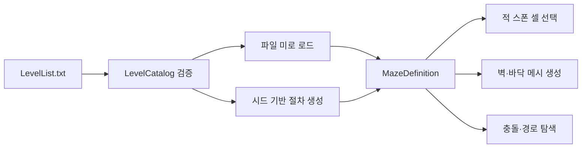

# 3D DirectX9 Maze

DirectX9 기반 1인칭 미로 탐색 게임입니다. 취업 준비 기간에 그래픽스 파이프라인, 카메라, 입력 처리, 충돌 처리, 간단한 게임 오브젝트를 직접 구현해 보기 위해 만든 프로젝트입니다.

- 시연 영상: https://youtu.be/5bMy5FtiVVI
- 솔루션: `DirectX9_Maze.sln`
- 주요 프로젝트: `DirectX9_Maze.vcxproj`


## 주요 기능

- Direct3D9 기반 렌더링 루프
- 1인칭 카메라와 마우스 시점 회전
- WASD/방향키 기반 플레이어 이동
- 타일 맵 기반 미로와 벽 충돌 처리
- 외부 목록 기반 다중 레벨 로딩과 클리어 후 전환
- 시드 기반 가변 크기 절차적 미로 생성
- 안내문, 출구, 클리어 UI
- 스카이박스와 낮/밤 전환
- 플레이어 손전등용 스팟 라이트
- 탑뷰/자유시점 디버그 뷰
- 프러스텀 컬링
- X 파일 기반 호랑이 모델 로딩과 공유 BFS 거리 필드 기반 다중 적 추적
- 총알 발사, 시간 기반 이동과 벽·적 연속 충돌 처리
- 적 HP·사망 처리와 플레이어 접촉 게임 오버·재시작
- 레벨별 수량·시드와 유효 통로 셀을 이용한 재현 가능한 다중 적 스폰

## 조작법

| 입력 | 동작 |
| --- | --- |
| `W`/`A`/`S`/`D`, 방향키 | 이동 |
| 마우스 이동 | 시점 회전 |
| 마우스 왼쪽 클릭 | 총알 발사 |
| `Q`/`E` | 좌우 회전 |
| `1` | 낮/밤 전환 |
| `F2` (Debug 빌드) | 컬링 확인용 탑뷰 전환 |
| `F3` (Debug 빌드) | 3초 워밍업 후 10초 성능 측정 |
| `3` | 손전등 전환 |
| `4` | 자유시점 전환 |
| `Esc` | 일시정지 |

## 코드 구성

| 파일 | 역할 |
| --- | --- |
| `main.cpp`, `main.h` | Direct3D 초기화, 메인 루프, 렌더링, 전역 게임 상태 |
| `Player.*` | 플레이어 이동, 회전, 충돌, 총알, 손전등 |
| `MazeGenerator.*` | 맵 데이터 기반 벽 버텍스 생성 |
| `MazeLoader.*`, `MazeDefinition.h` | 외부 레벨 파일 검증과 런타임 미로 데이터 |
| `ProceduralMaze.*` | 반복형 깊이 우선 탐색 기반 미로 생성과 최장 거리 출구 선택 |
| `LevelCatalog.*` | 파일·절차적 레벨 목록과 각 소스의 크기·시드·적 설정 검증 |
| `EnemySpawn.*` | 유효 통로 셀 수집과 시드 기반 적 스폰 위치 결정 |
| `MazePathfinding.*` | 플레이어 셀 기준 역방향 BFS 거리 필드 생성과 다음 이동 셀 선택 |
| `BulletCollision.*` | 투사체 이동 선분과 내부·외곽 벽의 연속 충돌 판정 |
| `CombatCollision.*` | 구체 겹침과 이동 구체의 최초 충돌 시각 계산 |
| `Frustum.*` | 프러스텀 평면 계산과 컬링 판정 |
| `SkyBox.*` | 스카이박스 텍스처와 렌더링 |
| `Notice.*`, `Exit.*` | 안내문과 출구 오브젝트 |
| `Tiger.*` | X 파일 모델 로딩, 셀 중심 추적 이동, 충돌 경계, HP와 사망 상태 |
| `Assets/Models`, `Assets/Textures` | 런타임 모델과 용도별 텍스처 |
| `Input.*` | 키 입력 상태 관리 |
| `FpsCounter.*` | 메인 루프의 delta time을 이용한 FPS 계산 |
| `PerformanceRecorder.*` | 실제 frame time 표본과 평균·p95·최대값 측정 |
| `ComUtils.h` | COM 포인터의 null 안전한 공통 해제 |
| `DirectX9_Maze.Tests` | Direct3D 실행 없이 순수 로직을 검증하는 콘솔 테스트 |
| `Assets/Data/Levels` | 파일·절차적 미로의 레벨 목록과 작성 규칙 |

## 핵심 기술

### 프러스텀 컬링과 카메라

카메라의 `View * Projection` 행렬을 역변환해 정규화 장치 좌표의 여덟 꼭짓점을 월드 공간으로 복원하고, 이 점들로 좌·우·상·하·근·원 여섯 평면을 구성합니다. 바닥 타일과 벽 면은 중심과 반크기로 표현한 AABB를 각 평면에 투영합니다. AABB의 중심 거리보다 투영 반지름이 작아 한 평면의 바깥에 완전히 놓이면 해당 면의 draw call을 생략합니다.

일반 1인칭 시점과 안내판의 힌트 탑뷰는 실제 렌더링 카메라의 프러스텀을 사용합니다. `F2` 개발용 탑뷰에서는 미로 전체를 위에서 보면서도 1인칭 카메라 기준으로 살아남은 면만 표시해 컬링 결과를 시각적으로 점검할 수 있도록 렌더링 카메라와 컬링 카메라를 의도적으로 분리했습니다.

탑뷰 카메라 높이는 고정값이 아니라 미로의 월드 너비·깊이, 수직 FOV와 창 종횡비로 계산합니다. 가로와 세로를 화면에 담는 데 필요한 거리 중 큰 값을 선택하고 여백을 더해 크기가 다른 미로도 한 화면에 들어오도록 했습니다.

### 미로 좌표와 월드 좌표

미로 데이터는 `cells[row][column]`으로 접근하며 행은 위에서 아래로, 열은 왼쪽에서 오른쪽으로 증가합니다. 월드 원점은 미로 중앙에 두고 열을 X축, 행을 반전한 값을 Z축에 대응시킵니다. 셀 중심과 월드 위치 사이의 양방향 변환을 공통 함수로 두어 플레이어 시작 위치, 적 스폰, 경로 탐색과 충돌 처리가 같은 좌표 규칙을 사용합니다.

```text
cell(row, column)
  <-> maze-centered world(x, z)
  -> spawn / collision / pathfinding / rendering
```

### 외부·절차적 미로 데이터와 레벨 전환

레벨 목록은 파일 미로와 절차적 미로를 같은 순서 목록으로 관리합니다. 파일 미로는 문자 종류, 행 너비와 필수·중복 마커를 검증하고, 절차적 미로는 시드 기반 반복형 깊이 우선 탐색으로 통로를 만든 뒤 BFS로 시작점에서 가장 먼 셀을 출구로 선택합니다. 두 입력은 모두 공통 `MazeDefinition`을 생성하므로 이후 메시 생성, 엔티티 배치, 충돌과 경로 탐색은 미로의 출처를 구분하지 않습니다.


```mermaid
flowchart LR
    A["LevelList.txt"] --> B["LevelCatalog 검증"]
    B --> C["파일 미로 로드"]
    B --> D["시드 기반 절차 생성"]
    C --> E["MazeDefinition"]
    D --> E
    E --> F["적 스폰 셀 선택"]
    E --> G["벽·바닥 메시 생성"]
    E --> H["충돌·경로 탐색"]
```

레벨을 전환할 때는 새 미로와 스폰 데이터를 먼저 검증한 뒤 기존 레벨의 지오메트리 버퍼를 해제하고 새 메시·안내판·출구·적을 생성합니다. 생성 실패 시 부분 생성된 버퍼를 다시 해제하고 오류 원인을 표시하며, 성공 시 플레이어와 적 위치, 게임 상태, 입력과 거리 필드를 새 레벨 기준으로 초기화합니다.

### Direct3D9 리소스 수명 관리

정적 정점·인덱스 버퍼는 `D3DPOOL_MANAGED`로 생성해 장치 리셋 시 Direct3D가 내용을 복원하도록 했습니다. 반면 내부적으로 기본 풀 리소스를 사용하는 D3DX 폰트는 창 크기 변경 전 `OnLostDevice`, 장치 리셋 성공 후 `OnResetDevice`를 호출합니다. 리셋 뒤에는 백버퍼 크기, 렌더 상태, 기본 재질과 카메라 종횡비를 현재 클라이언트 영역에 맞춰 다시 설정합니다.

COM 리소스는 `SafeRelease`로 해제 후 null 상태를 보장하고, 공통 버퍼 생성 함수가 생성·Lock·복사·Unlock과 실패 시 정리를 한 경로에서 처리합니다. 종료 시에는 레벨 지오메트리, 텍스처, 폰트, 기본 메시와 Direct3D 장치를 소유 범위별로 해제합니다.

### 플레이어와 투사체 충돌

플레이어는 목표 위치를 바로 확정하지 않고 X축과 Z축을 순서대로 벽 경계에 맞춰 보정합니다. 한 축의 이동을 유지하면서 충돌한 축만 밀어내기 때문에 벽을 따라 미끄러질 수 있고, 모서리에서 매 프레임 전진과 원위치 복구를 반복하던 떨림을 줄였습니다.

투사체는 현재 위치만 겹침 검사하지 않고 한 프레임의 시작점과 끝점 사이를 연속 검사합니다. 투사체 반지름만큼 확장한 벽 AABB와 이동 구체·적 구체의 최초 충돌 시각을 각각 구한 뒤 더 먼저 만난 대상을 처리합니다. 따라서 낮은 프레임 속도에서도 벽이나 적을 통과하는 터널링을 막고, 벽 뒤의 적이 먼저 피격되는 문제도 방지합니다.

### 공유 BFS 기반 다중 적 추적

각 적이 플레이어까지 개별 경로를 탐색하는 대신 플레이어 셀을 시작점으로 역방향 BFS를 한 번 수행해 모든 통로 셀의 거리를 기록합니다. 이 거리 필드는 모든 적이 공유하며 플레이어가 다른 셀로 이동했을 때만 다시 계산합니다. 각 적은 현재 셀의 네 이웃 중 거리값이 더 작은 셀을 선택하고 셀 중심까지 이동하므로 벽과 모서리를 통과하지 않고 최단 격자 경로를 따라갑니다.

- 거리 필드 생성: 플레이어 셀 변경 시 `O(rows * columns)`
- 적 한 마리의 다음 셀 선택: 네 이웃만 비교하므로 `O(1)`
- 제한: 격자 경로이므로 곡선 보간이나 동적 장애물 회피는 지원하지 않음

적 3마리에서 30마리로 늘린 고정 미로 측정에서 평균과 p95 frame time은 각각 약 10% 증가했습니다. 자세한 조건과 수치는 [`docs/PERFORMANCE.md`](docs/PERFORMANCE.md)에 기록했습니다.

## 개선 전후 요약

이 프로젝트는 기존 완성작에 기능만 추가한 것이 아니라, 현재 관점에서 구조와 실패 경로를 다시 검토하고 검증 가능한 형태로 개선했습니다.

| 개선 전 | 개선 후 |
| --- | --- |
| 코드의 고정 크기 문자 배열 미로 | 검증형 외부 파일, 레벨 목록과 시드 기반 절차적 미로 |
| 고정 위치의 단일 난수 이동 적 | 유효 셀 기반 다중 스폰과 공유 BFS 최단 경로 추적 |
| 프레임 끝 위치 중심의 이동·충돌 | 시간 기반 이동, 축 분리 플레이어 충돌과 투사체 연속 충돌 |
| 호출부별 COM 해제와 불완전한 실패 처리 | 공통 안전 해제·버퍼 생성과 장치 리셋·부분 실패 정리 |
| 빌드와 육안 실행 중심 검증 | 순수 로직 테스트 40개, 스모크 테스트와 정량 성능 측정 |

주제별 문제, 선택, 검증 근거와 남은 한계는 [`docs/IMPROVEMENTS.md`](docs/IMPROVEMENTS.md)에 정리했습니다.

## 개발 환경

- Visual Studio 2022와 `Desktop development with C++` 워크로드
- Windows 10 SDK
- Platform Toolset `v143`
- ISO C++17 (`/std:c++17`)
- DirectX SDK June 2010

검증 기준 구성은 솔루션의 `Debug|x86`과 `Release|x86`입니다. 두 구성은 프로젝트에서 각각 `Debug|Win32`, `Release|Win32`로 매핑되며 다음 DirectX SDK 기본 설치 경로를 참조합니다.

```text
C:\Program Files (x86)\Microsoft DirectX SDK (June 2010)\Include
C:\Program Files (x86)\Microsoft DirectX SDK (June 2010)\Lib\x86
```

## 빌드 및 실행

### Visual Studio

1. 위 개발 환경과 DirectX SDK를 설치합니다.
2. 저장소 루트의 `DirectX9_Maze.sln`을 Visual Studio 2022로 엽니다.
3. 솔루션 구성을 `Debug`, 플랫폼을 `x86`으로 선택합니다.
4. `DirectX9_Maze` 프로젝트를 시작 프로젝트로 설정합니다.
5. `Build > Build Solution`으로 빌드합니다.
6. `Debug > Start Without Debugging`으로 실행합니다.

빌드 결과는 저장소 루트의 `Debug/DirectX9_Maze.exe`에 생성됩니다. 텍스처와 X 파일 모델을 상대 경로로 읽으므로 실행 작업 디렉터리는 저장소 루트여야 합니다. Visual Studio에서 실행하면 기본 프로젝트 디렉터리가 사용됩니다.

### 명령줄

Visual Studio 2022 Community 기본 설치 경로를 사용하는 경우, 저장소 루트의 PowerShell에서 다음 명령으로 빌드할 수 있습니다.

```powershell
& "C:\Program Files\Microsoft Visual Studio\2022\Community\MSBuild\Current\Bin\MSBuild.exe" `
  .\DirectX9_Maze.sln /p:Configuration=Debug /p:Platform=x86
```

빌드 후 같은 저장소 루트에서 실행합니다.

```powershell
.\Debug\DirectX9_Maze.exe
```

순수 로직 자동 테스트는 같은 위치에서 다음 명령으로 실행합니다.

```powershell
.\Debug\DirectX9_Maze.Tests.exe
```

모든 테스트가 통과하면 종료 코드 `0`, 하나라도 실패하면 종료 코드 `1`을 반환합니다.

### Release 패키지 실행

1. `DirectX9_Maze-Release-x86.zip`을 원하는 위치에 압축 해제합니다.
2. 아래 x86 런타임이 없다면 Microsoft 공식 배포본을 설치합니다.
3. 압축 해제된 `DirectX9_Maze/DirectX9_Maze.exe`를 실행합니다.

필수 런타임:

- [`d3dx9_43.dll`을 제공하는 DirectX End-User Runtimes (June 2010)](https://www.microsoft.com/en-US/download/details.aspx?id=8109)
- [`MSVCP140.dll`, `VCRUNTIME140.dll`을 제공하는 최신 Visual C++ Redistributable x86](https://aka.ms/vc14/vc_redist.x86.exe)

### Release 패키지 생성

저장소 루트에서 Release 빌드와 자동 테스트를 실행합니다.

```powershell
& "C:\Program Files\Microsoft Visual Studio\2022\Community\MSBuild\Current\Bin\MSBuild.exe" `
  .\DirectX9_Maze.sln /p:Configuration=Release /p:Platform=x86

.\Release\DirectX9_Maze.Tests.exe
```

그다음 현재 PowerShell 프로세스에만 실행 정책 예외를 적용해 패키징 스크립트를 실행합니다.

```powershell
powershell.exe -NoProfile -ExecutionPolicy Bypass `
  -File .\Scripts\Build-ReleasePackage.ps1
```

생성 결과:

```text
artifacts/DirectX9_Maze/
artifacts/DirectX9_Maze-Release-x86.zip
```

### 구성 제약

- 빌드와 실행이 확인된 구성은 `Debug|x86`과 `Release|x86`입니다.
- `x64` 구성은 DirectX SDK x64 library와 linker 설정을 구성하지 않아 지원 및 검증 대상에서 제외합니다.
- `d3dx9.h` 또는 `d3dx9.lib`를 찾지 못하면 DirectX SDK 설치 여부와 위 기본 경로를 확인합니다.
- Release 실행에는 DirectX June 2010 추가 런타임과 Visual C++ Redistributable x86이 필요합니다.
- 텍스처나 호랑이 모델이 표시되지 않으면 실행 작업 디렉터리가 저장소 또는 압축 해제된 패키지의 루트인지 확인합니다.

## 현재 검증 상태

- `Debug|x86` 빌드 성공: 경고 0개, 오류 0개
- `Release|x86` 빌드 성공: 경고 0개, 오류 0개
- Debug 및 Release 자동 테스트 각각 40개 통과
- 허용 문서와 에셋 18개를 포함한 ZIP 생성 및 패키지 폴더 실행 확인
- Windows 환경에서 게임 실행 정상 확인
- UTF-8 소스 변환 후 한글 문자열 출력 정상 확인
- 필수 텍스처 누락 시 초기화 실패 안내 후 크래시 없이 종료됨을 확인
- 미로 로더·생성기, 레벨 목록, 셀 좌표 변환, 경로 탐색, 스폰, 투사체·구체 연속 충돌과 성능 기록기 자동 테스트 40개 통과
- 서로 다른 크기의 파일 레벨 2개와 절차적 레벨 1개의 전환 및 상태·리소스 재설정 확인
- 적 피격·사망, 플레이어 접촉 게임 오버와 현재 레벨 재시작 확인
- 레벨 1·2·3에서 각각 적 1·2·3마리가 시드 기반 위치에 생성되고 처치 후 재생성되지 않음을 확인
- 여러 적이 공유 거리 필드로 플레이어를 추적하고 벽·모서리를 통과하지 않으며 이동 방향을 바라보는 것을 확인
- 대표 레벨과 적 3·10·30마리 조건에서 평균·p95·최대 frame time 측정
- 수동 검증 절차: [`docs/SMOKE_TEST.md`](docs/SMOKE_TEST.md)
- 성능 측정 조건과 결과: [`docs/PERFORMANCE.md`](docs/PERFORMANCE.md)
- 개선 전후 문제·선택·검증 근거: [`docs/IMPROVEMENTS.md`](docs/IMPROVEMENTS.md)
- 외부 에셋 출처와 공개 상태: [`docs/ASSET_LICENSES.md`](docs/ASSET_LICENSES.md)

## 구현하며 다룬 문제

- 프레임 속도에 따라 이동 속도가 달라지는 문제를 시간 기반 이동으로 완화했습니다.
- 마우스 커서를 윈도우 중앙으로 되돌리며 FPS 스타일 시점 회전을 구현했습니다.
- 외부 문자 기반 레벨 파일을 검증해 가변 크기 미로와 플레이어 시작점, 안내판, 출구를 구성하도록 개선했습니다.
- 같은 시드에서 같은 구조를 만드는 반복형 깊이 우선 탐색 미로와 BFS 기반 원거리 출구 선택을 구현했습니다.
- 외부 레벨 목록에서 파일·절차적 소스와 적 설정을 읽고 클리어 시 기존 지오메트리와 게임 상태를 정리한 뒤 다음 미로를 재구성합니다.
- 벽, 플레이어 시작점, 출구와 안내판을 제외한 통로 셀을 섞어 중복 없는 적 위치를 결정하고 같은 시드에서 같은 배치를 재현합니다.
- Billboard 회전을 기본 방향에서 다시 계산해 누적 오차를 제거하고 레벨 전환·자유시점 복원 시 즉시 방향을 갱신합니다.
- 총알의 프레임 시작점과 끝점 사이 선분을 반지름만큼 확장한 벽 AABB와 검사해 낮은 프레임에서도 벽 관통을 방지합니다.
- 카메라 프러스텀을 계산해 타일과 벽 면을 그릴지 판단했습니다.
- 가변 크기 미로가 탑뷰에 들어오도록 월드 경계, FOV와 창 종횡비로 카메라 높이를 자동 계산합니다.
- 플레이어 셀에서 역방향 BFS 거리 필드를 한 번 계산해 모든 적이 공유하고, 셀 중심을 따라 최단 경로로 추적하도록 기존 난수 이동을 교체했습니다.

## 현재 한계

이 프로젝트는 학습용으로 시작해 기능을 빠르게 붙인 코드라 구조적인 부채가 남아 있습니다.

- `main.cpp`에 초기화, 입력, 업데이트, 렌더링, UI, 게임 규칙이 많이 모여 있습니다.
- 전역 상태와 리소스 소유 객체가 여러 모듈에 걸쳐 있어 전체 수명 주기를 파악하기 어렵습니다.
- UI 좌표와 일부 게임 설정 값이 `main.cpp`에 하드코딩되어 있습니다.
- 자동 테스트는 미로 로더, 레벨 목록, 좌표·경로 탐색과 순수 충돌 계산에 한정되며 Direct3D 리소스 전환, 적 상태와 실제 추적 동작은 수동 검증에 의존합니다.
- 다중 적은 현재 동일한 X 파일 모델 자원을 인스턴스마다 개별 로드하므로 적 수를 크게 늘리기 전에 공유 모델 자원 구조가 필요합니다.
- `x64` 구성은 DirectX SDK library와 linker 설정을 별도로 구성하지 않아 지원하지 않습니다.

장기 개선 방향과 진행 상태는 [`PROJECT_GUIDE.md`](PROJECT_GUIDE.md)와 [`docs/ROADMAP.md`](docs/ROADMAP.md)를 참고하세요. 프로젝트별 C++ 네이밍 기준은 [`docs/CODING_CONVENTIONS.md`](docs/CODING_CONVENTIONS.md), 작업 중 정리한 개념과 선택 이유는 [`docs/LEARNING_NOTES.md`](docs/LEARNING_NOTES.md), 개선 전후 근거는 [`docs/IMPROVEMENTS.md`](docs/IMPROVEMENTS.md), 성능 측정은 [`docs/PERFORMANCE.md`](docs/PERFORMANCE.md), 외부 에셋의 출처와 공개 판단은 [`docs/ASSET_LICENSES.md`](docs/ASSET_LICENSES.md)에 기록되어 있습니다.
